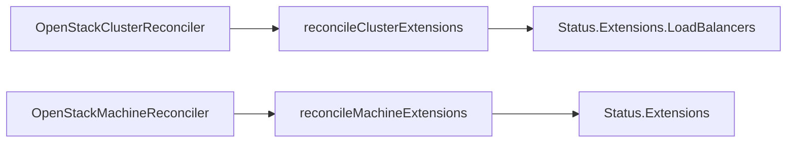

# Kubernetes Cluster API Provider OpenStack

------

Kubernetes-native declarative infrastructure for OpenStack.

For documentation, see the [Cluster API Provider OpenStack book](https://cluster-api-openstack.sigs.k8s.io/).

## What is the Cluster API Provider OpenStack

The [Cluster API][cluster_api] brings
declarative, Kubernetes-style APIs to cluster creation, configuration and
management.

The API itself is shared across multiple cloud providers allowing for true OpenStack
hybrid deployments of Kubernetes. It is built atop the lessons learned from
previous cluster managers such as [kops][kops] and
[kubicorn][kubicorn].

## Launching a Kubernetes cluster on OpenStack

- Check out the [Cluster API Quick Start](https://cluster-api.sigs.k8s.io/user/quick-start.html) to create your first Kubernetes cluster on OpenStack using Cluster API. If you wish to use the external cloud provider, check out the [External Cloud Provider](docs/book/src/topics/external-cloud-provider.md) as well.

## Features

- Native Kubernetes manifests and API
- Choice of Linux distribution (as long as a current cloud-init is available)
- Support for single and multi-node control plane clusters
- Deploy clusters with and without LBaaS available (only cluster with LBaaS can be upgraded)
- Support for security groups
- cloud-init based nodes bootstrapping

## Current Extension Goal (BA/ACP + OpenStack Infra)

参考 `cluster-api/bootstrap/ansible/README.md` 中的 BA 架构，我们在 CAPO 中的最新目标是补齐 Ansible Bootstrap（BA）与 Ansible Control Plane（ACP）工作流所需的 OpenStack 基础设施能力，使其能够端到端运行：

- **复用当前仓库**：直接在 CAPO 内提供 BA/ACP 所消费的 infra vars、Secret 等数据面，而不是再 Fork 一个几乎相同的代码库。
- **最小侵入点**：在不改变 Cluster API 既有 Contract/CRD 的前提下，把 OpenStack 逻辑封装在 provider 内部，通过现有接口为 BA/ACP 提供 inventory、vars、SSH 凭据等。
- **交付完整链路**：实现 BA/ACP 依赖的 OpenStack 基础设施控制器，实现集群引导、扩缩容、升级等流程在 Ansible 工作流下可用。

### 基础设施 Provider 调谐重点

| README 字段 | Infra 类型 | 建议 Extensions 路径 | 数据来源/写入方 | 消费方及用途 |
|-------------|------------|---------------------|-----------------|--------------|
| `kube_network_plugin` | Cluster | `spec.extensions.networking.kubeNetworkPlugin` | 用户/ClusterClass | BA/ACP 渲染 vars，决定使用 cilium/flannel 等 |
| `cilium_openstack_project_id` | Cluster | `status.extensions.networking.cilium.projectID` | CAPO | BA/ACP 配置 Cilium 与 OpenStack 集成 |
| `cilium_openstack_default_subnet_id` | Cluster | `status.extensions.networking.cilium.defaultSubnetID` | CAPO | BA/ACP 提供给 VPC CNI |
| `cilium_openstack_security_group_ids` | Cluster | `status.extensions.networking.cilium.securityGroupIDs[]` | CAPO | BA/ACP 配置 Pod/节点安全组 |
| `vpc_cni_webhook_enable` | Cluster | `status.extensions.networking.cilium.webhookEnable` | CAPO | BA 控制是否部署相关 webhook |
| `master_virtual_vip` | Cluster | `status.extensions.loadBalancers.controlPlane.vip` | CAPO（API Server LB/VIP） | BA Inventory/vars |
| `ingress_virtual_vip` | Cluster | `status.extensions.loadBalancers.ingress.vip` | CAPO（Ingress LB） | BA/Harbor |
| `keepalived_interface` | Machine | `spec.extensions.networkInterfaces.keepalived` | 用户/ClusterClass | BA 设置 keepalived |
| `harbor_addr` | Cluster | `status.extensions.loadBalancers.ingress.vip` | CAPO/业务配置 | BA 渲染 Harbor 入口 |
| `cloud_master_vip` | Cluster | `status.extensions.openStack.mgmt` | CAPO | BA/外部访问 |
| `openstack_auth_domain` | Cluster | `status.extensions.openStack.keystone` | CAPO（从 IdentityRef 解出只读 endpoint） | BA vars；凭证仍通过 SecretRef |
| `openstack_cinder_domain` | Cluster | `status.extensions.openStack.cinder` | CAPO | BA/存储插件 |
| `openstack_nova_domain` | Cluster | `status.extensions.openStack.nova` | CAPO | BA/Cloud provider 配置 |
| `openstack_neutron_domain` | Cluster | `status.extensions.openStack.neutron` | CAPO | BA/网络插件 |
| `openstack_project_name` | Cluster | `status.extensions.openStack.project` | CAPO | BA vars |
| `openstack_project_domain_name` | Cluster | `status.extensions.openStack.projectDomain` | CAPO | BA vars |
| `openstack_region_name` | Cluster | `status.extensions.openStack.region` | CAPO | BA vars |
| `ntp_server` | Cluster | `status.extensions.platform.ntp.server` | CAPO（基础设施/跳板配置） | BA hosts/vars |
| `vip_mgmt` | Cluster | `status.extensions.platform.management.vip` | CAPO（跳板机） | BA/运维脚本 |
| `flannel_interface` | Cluster | `spec.extensions.networkInterfaces.flannel` | 用户/ClusterClass（集群唯一配置） | BA vars |
| `node_resources.<machine name>` | Machine | `status.extensions.nodeResources[machine].reserved` | CAPO（根据 flavor/策略） | BA 生成 `node_resources` 字段 |

### Extensions 渲染流程

> 入口位于 `api/v1beta1/extensions_types.go` 与 `controllers/extensions_reconcile.go`，方便后续在扩展逻辑更完整时与社区主干代码解耦。

------

## Compatibility with Cluster API

This provider's versions are compatible with the following versions of Cluster API:

| Minor release | CAPI version |
|---------------|--------------|
| v0.14         | >=v1.12      |
| v0.13         | >=v1.11      |
| v0.12         | >=v1.9       |

This is based on the version of Cluster API that the provider was built and tested against.
Older versions may work if the APIs have not changed.

Each version of Cluster API for OpenStack will attempt to support two Kubernetes versions.

**NOTE:** As the versioning for this project is tied to the versioning of Cluster API, future modifications to this
policy may be made to more closely aligned with other providers in the Cluster API ecosystem.

**NOTE:** The minimum microversion of CAPI using nova is `2.60` now due to `server tags` support as well permitting `multiattach` volume types, see [code](https://github.com/kubernetes-sigs/cluster-api-provider-openstack/blob/c052e7e600f0e5ebddc839c08746bb636e79be87/pkg/cloud/services/compute/service.go#L38) for additional information.

**NOTE:** We require Keystone v3 for authentication.

------

## Development versions

ClusterAPI provider OpenStack images and manifests are published after every PR merge and once every day:

* With a Google Cloud account you can get a quick overview [here](https://console.cloud.google.com/storage/browser/artifacts.k8s-staging-capi-openstack.appspot.com/components)
* The manifests are available under:
  * [master/infrastructure-components.yaml](https://storage.googleapis.com/artifacts.k8s-staging-capi-openstack.appspot.com/components/master/infrastructure-components.yaml):
    latest build from the main branch, overwritten after every merge
  * e.g. [nightly_master_20210407/infrastructure-components.yaml](https://storage.googleapis.com/artifacts.k8s-staging-capi-openstack.appspot.com/components/nightly_master_20210407/infrastructure-components.yaml): build of the main branch from 7th April

These artifacts are published via Prow and Google Cloud Build. The corresponding job definitions can
be found [here](https://github.com/kubernetes/test-infra/blob/4d146721aaec27a3c93299956f8d64af2357d64a/config/jobs/image-pushing/k8s-staging-cluster-api.yaml).

------

## Operating system images

Note: Cluster API Provider OpenStack relies on a few prerequisites which have to be already
installed in the used operating system images, e.g. a container runtime, kubelet, kubeadm,.. .
Reference images can be found in [kubernetes-sigs/image-builder](https://github.com/kubernetes-sigs/image-builder/tree/master/images/capi). If it isn't possible to pre-install those
 prerequisites in the image, you can always deploy and execute some custom scripts
 through the [KubeadmConfig](https://github.com/kubernetes-sigs/cluster-api-bootstrap-provider-kubeadm).

------

## Documentation

Please see our [book](https://cluster-api-openstack.sigs.k8s.io) for in-depth documentation.

## Getting involved and contributing

Are you interested in contributing to cluster-api-provider-openstack? We, the
maintainers and community, would love your suggestions, contributions, and help!
Also, the maintainers can be contacted at any time to learn more about how to get
involved:

- via the [cluster-api-openstack channel on Kubernetes Slack][slack]
- via the [SIG-Cluster-Lifecycle Mailing List](https://groups.google.com/forum/#!forum/kubernetes-sig-cluster-lifecycle).
- during our Office Hours
  - bi-weekly on Wednesdays @ 12:00 UTC on Zoom (link in meeting notes)
  - Previous meetings:
    - [notes this year][office-hours-notes]
    - [notes in 2023][office-hours-notes-2023]
    - [notes in 2022][office-hours-notes-2022]
    - [recordings][office-hours-recordings]

In the interest of getting more new people involved we try to tag issues with
[`good first issue`][good_first_issue].
These are typically issues that have smaller scope but are good ways to start
to get acquainted with the codebase.

We also encourage ALL active community participants to act as if they are
maintainers, even if you don't have "official" write permissions. This is a
community effort, we are here to serve the Kubernetes community. If you have an
active interest and you want to get involved, you have real power! Don't assume
that the only people who can get things done around here are the "maintainers".

We also would love to add more "official" maintainers, so show us what you can
do!

This repository uses the Kubernetes bots. See a full list of the commands [here][prow].
Please also refer to the [Contribution Guide](CONTRIBUTING.md) and the [Development Guide](docs/book/src/development/development.md) for this project.

## Code of conduct

Participation in the Kubernetes community is governed by the [Kubernetes Code of Conduct](code-of-conduct.md).

## Github issues

### Bugs

If you think you have found a bug please follow the instructions below.

- Please spend a small amount of time giving due diligence to the issue tracker. Your issue might be a duplicate.
- Get the logs from the cluster controllers. Please paste this into your issue.
- Open a [new issue][new_bug_issue].
- Remember that users might be searching for your issue in the future, so please give it a meaningful title to help others.
- Feel free to reach out to the Cluster API community on the [Kubernetes Slack][slack].

### Tracking new features

We also use the issue tracker to track features. If you have an idea for a feature, or think you can help Cluster API Provider OpenStack become even more awesome follow the steps below.

- Open a [new issue][new_feature_issue].
- Remember that users might be searching for your issue in the future, so please
  give it a meaningful title to help others.
- Clearly define the use case, using concrete examples.
- Some of our larger features will require some design. If you would like to
  include a technical design for your feature, please include it in the issue.
- After the new feature is well understood, and the design agreed upon, we can
  start coding the feature. We would love for you to code it. So please open
  up a **WIP** *(work in progress)* pull request, and happy coding.

<!-- References -->

[cluster_api]: https://github.com/kubernetes-sigs/cluster-api
[kops]: https://github.com/kubernetes/kops
[kubicorn]: http://kubicorn.io/
[slack]: https://kubernetes.slack.com/messages/cluster-api-openstack
[office-hours-notes]: https://cluster-api-openstack.sigs.k8s.io/agenda
[office-hours-notes-2023]: https://cluster-api-openstack.sigs.k8s.io/agenda/2023.html
[office-hours-notes-2022]: https://cluster-api-openstack.sigs.k8s.io/agenda/2022.html
[office-hours-recordings]: https://www.youtube.com/playlist?list=PL69nYSiGNLP29D0nYgAGWt1ZFqS9Z7lw4
[good_first_issue]: https://github.com/kubernetes-sigs/cluster-api-provider-openstack/issues?q=is%3Aissue+is%3Aopen+sort%3Aupdated-desc+label%3A%22good+first+issue%22
[prow]: https://go.k8s.io/bot-commands
[new_bug_issue]: https://github.com/kubernetes-sigs/cluster-api-provider-openstack/issues/new?assignees=&labels=&template=bug_report.md
[new_feature_issue]: https://github.com/kubernetes-sigs/cluster-api-provider-openstack/issues/new?assignees=&labels=&template=feature_request.md
